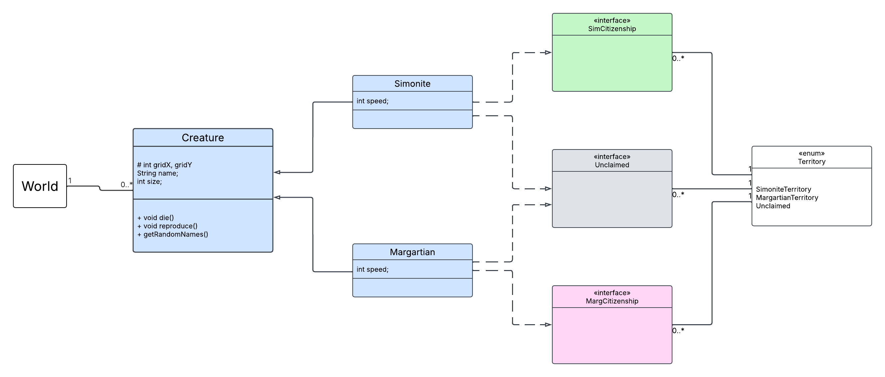

# This world focuses around claiming territory
Each Creature/Species has their own space of territory.
They can walk on only their own and the 'unclaimed' territory.
If a creature comes in to contact with another creature in the unclaimed space, they can attack.
If a creature dies by the hands of another creature, the one that survives gets their territory expanded by the space they occupy.

## Clone the Repository Locally:
Navigate to the directory you want the project to live then run this command:

`git clone git@github.com:UM-CS/project-4-territory_simulation.git`

## Pull Request Instructions
In the terminal, make sure your current working directory is where you cloned the project.
Before making changes, run:

`git checkout -b YourName`

Replace YourName with your actual name.
This makes a branch where changes you make are isolated from the main project.
After you've made changes that you wanted, run:

`git add .`

`git commit -m "details about the changes you made."`

`git push --set-upstream origin YourName`

Again, replace YourName with the same name you entered earlier.

Go to [https://github.com/UM-CS/project-4-territory_simulation]
And there should be a convienient button to create the pull request where I can review it and push it to the main branch.

# Lucid Chart UML:
https://lucid.app/lucidchart/4b81181e-1e74-4dd0-9ea6-8157ff392bb8/edit?invitationId=inv_1a2d16df-507d-4f23-9397-cfb25d1879ac

